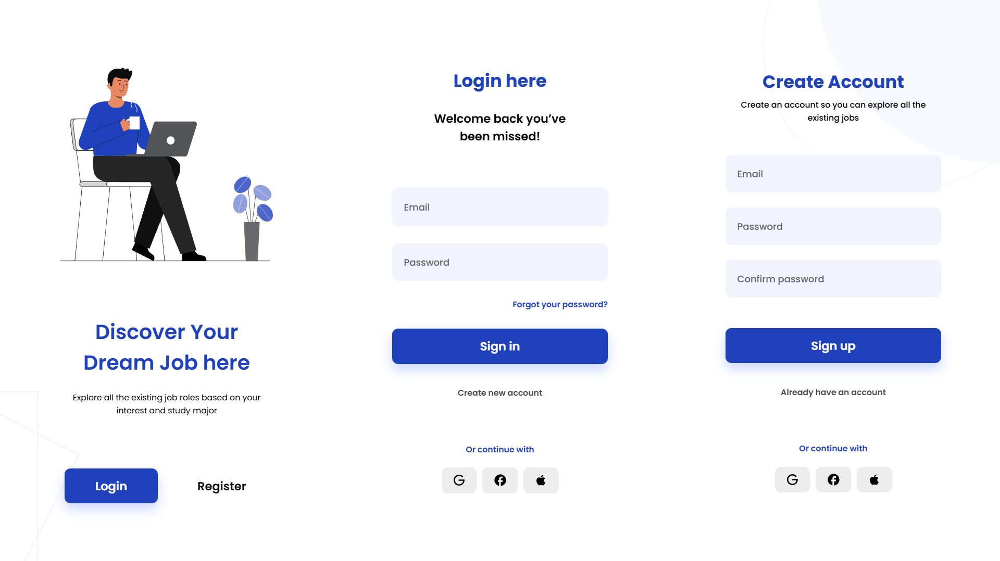

# Login Register App

Mobile app built with HTML, CSS and JS from a Figma design.

## 📚 Project Features
- Built using the BEM (Block Element Modifier) methodology
- Structured in a single HTML file with clean and readable code
- Designed primarily for mobile devices (limited desktop support)
- Includes smooth UI animations for inputs, buttons, and interface elements
- Uses JavaScript to handle section switching and dynamic content display
- Optimized for fast loading and performance

## 📗 Links
- [Figma mockup](https://www.figma.com/community/file/1282291722642517542)

## 📖 Live Demo
https://otomje.github.io/login-register-app/

---

